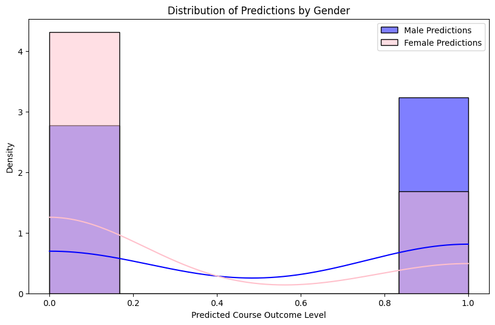

# Comparative Study of Deep Learning Models for Gender Bias Mitigation in Educational Data

## Introduction

This project explores the application of deep learning to mitigate gender bias in predicting course outcomes. We evaluate and compare four advanced models—Domain-Adversarial Neural Networks (DANN), Adversarial Debiasing, FairGAN, and Fair Autoencoder in Latent Space—to identify the best-performing approach in terms of fairness and predictive accuracy.

## Problem Statement

Gender bias in educational data can lead to unfair predictions, disproportionately impacting students based on their gender. This study aims to mitigate such bias while ensuring accurate predictions of course outcomes.

## Objectives

1. Investigate the presence of gender bias in educational datasets.
2. Implement and evaluate four deep learning-based bias mitigation techniques.
3. Compare the models using fairness metrics (e.g., demographic parity, disparate impact) and predictive accuracy.
4. Identify the most effective model for mitigating gender bias in educational outcomes.

## Methodology

The study involves the following key models:
1. **Domain-Adversarial Neural Networks (DANN)**: Employs adversarial training to minimize gender influence in the feature space.
2. **Adversarial Debiasing**: Integrates an adversarial network during training to reduce gender-based bias.
3. **FairGAN**: A generative adversarial network designed to produce synthetic data with fairness constraints.
4. **Fair Autoencoder in Latent Space**: Uses an autoencoder to transform data into a latent space, ensuring fairness through reconstruction.

## Dataset

The dataset used in this project is anonymized student performance data, which includes features such as:
- Sensitive Attribute: **Gender**
- Target Variable: **Average Course Outcome Level**
- Additional features: **Age**, **12th-grade marks**, **weekly study hours**, **faculty feedback**, etc.

The dataset was preprocessed to ensure numerical consistency, handle missing values, and encode categorical variables.

## Preprocessing

1. Removed null and duplicate values.
2. Scaled numerical features using **MinMax scaling**.
3. Encoded categorical variables using **one-hot encoding**.
4. Split the data into training and testing subsets.

## Implementation

Each model was implemented using Python and frameworks like **TensorFlow** and **PyTorch**. Training was performed using the preprocessed dataset, and fairness constraints were applied for debiasing. Key fairness metrics were calculated for both the baseline and debiased models.

## Results

### Adversarial Debiasing
- **Bias Mitigation**: Demonstrated the most consistent bias reduction. The model achieved a disparate impact ratio of 1.01, indicating minimal gender bias in its predictions while maintaining a high level of predictive accuracy.
- **Accuracy**: The model maintained high predictive accuracy with minimal drop in performance while reducing bias across the gender-sensitive attribute.
- 
 
### FairGAN
- **Bias Mitigation**: FairGAN effectively balanced fairness and predictive accuracy. The demographic parity improved to 0.89, showing a significant reduction in gender bias. This model uses synthetic data generation with fairness constraints, which makes it highly flexible but computationally intensive.
- **Accuracy**: FairGAN showed a slight drop in accuracy due to the complexity of fairness constraints but managed to preserve a reasonable level of performance while mitigating bias.
- 

### Domain-Adversarial Neural Networks (DANN)
- **Bias Mitigation**: DANN showed notable improvements in fairness but was less effective compared to Adversarial Debiasing and FairGAN in balancing fairness with predictive accuracy. The gender bias reduction was significant, but the accuracy was slightly lower than the other models.
- **Accuracy**: The model showed good accuracy, but its performance was compromised when compared to Adversarial Debiasing and FairGAN in terms of fairness and prediction.
- 

### Fair Autoencoder in Latent Space
- **Bias Mitigation**: The Fair Autoencoder model demonstrated competitive results, reducing bias effectively in the latent space. However, it requires further optimization to handle large-scale datasets effectively.
- **Accuracy**: The model showed a good trade-off between fairness and accuracy, but additional refinement is necessary for better performance in real-world applications.
- 

---

### Comparative Summary

- **Best Bias Mitigation**: **Adversarial Debiasing** and **FairGAN** achieved the best balance between bias mitigation and predictive accuracy.
- **Best Fairness**: **FairGAN** showed the highest improvement in fairness metrics, though it was computationally intensive.
- **Best Accuracy**: **Adversarial Debiasing** showed the most consistent accuracy, with a near-neutral disparity ratio.
- **Promising Results**: **DANN** and **Fair Autoencoders** both showed promise but require further optimization for better fairness and scalability.

## Inferences

1. **Adversarial Debiasing** and **FairGAN** were the best-performing models in terms of mitigating bias and preserving accuracy.
2. **FairGAN**’s synthetic data generation approach offers flexibility but is computationally intensive.
3. **Adversarial Debiasing** achieves a strong trade-off between fairness and predictive performance in real-world scenarios.
4. **DANN** and **Fair Autoencoders** show promise but need refinement for optimal fairness gains.

## Future Work

1. Extend the study to include additional sensitive attributes (e.g., race, socioeconomic status).
2. Explore ensemble methods for combining multiple debiasing techniques.
3. Evaluate models on larger and more diverse datasets.
4. Deploy models in real-world educational platforms for further testing.

## Conclusion

This project demonstrates that **Adversarial Debiasing** and **FairGAN** are the most effective models for mitigating gender bias in educational predictions. By ensuring fairness and accuracy, these methods pave the way for equitable decision-making in educational systems.

## Technologies Used

- **Programming Language**: Python
- **Libraries**: TensorFlow, PyTorch, NumPy, Pandas, Scikit-learn, AIF360
- **Visualization**: Matplotlib, Seaborn
- **Tools**: Jupyter Notebook
